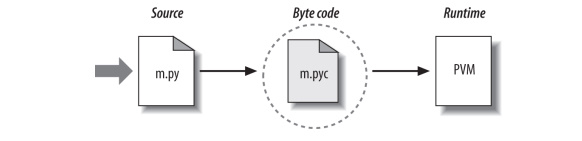
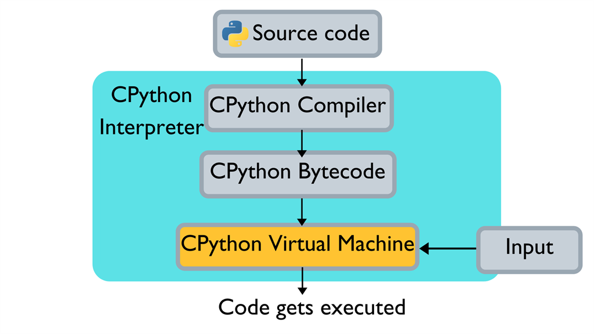

# 1. Giới thiệu về interpreter

Trình thông dịch là một loại chương trình thực thi các chương trình khác. Khi bạn viết một chương trình Python, trình thông dịch Python đọc chương trình của bạn và thực hiện các kiến trúc trong đó.

Khi packages Python được cài đặt trên máy, nó có một số thành phần ít nhất là một trình thông dịch và một thư viện hỗ trợ.

Khi bạn nhờ Python chạy tập lệnh của mình, có một số bước mà Python thực hiện ra trước khi mã của bạn thực sự bắt đầu chạy. Cụ thể, nó khi lần đầu tiên được biên dịch thì tạo ra được gọi là "code byte" và sau đó được chuyển tới "virtual machine".


# 2. Biên dịch mã bytecode

Khi bạn thực thi một chương trình, Python đầu tiên biên dịch mã nguồn của bạn (các câu lệnh trong file của bạn) thành một định dạng được gọi là mã byte thành cách trình bày **mã cấp thấp hơn** không phải là mã máy, độc lập với nền tảng của mã nguồn của bạn. Về cơ bản, Python dịch từng câu lệnh nguồn của bạn thành một nhóm hướng dẫn mã byte bằng cách phân tách chúng thành các bước riêng lẻ. Việc dịch mã byte này được thực hiện để tăng tốc độ thực thi — mã byte có thể chạy nhanh hơn nhiều so với các câu lệnh mã nguồn ban đầu trong tệp văn bản của bạn.

Nó sẽ lưu trữ mã byte của các chương trình của bạn trong các tệp kết thúc bằng phần mở rộng .pyc (“.pyc” có nghĩa là nguồn “.py” được biên dịch).

Python lưu các tệp mã byte .pyc của nó trong một thư mục con có tên \_\_pycache\_\_ nằm trong thư mục chứa các tệp nguồn của bạn và trong các tệp có tên xác định phiên bản Python đã tạo ra chúng (ví dụ: script.cpython-33.pyc). Các thư mục con \_\_pycache\_\_ mới giúp tránh lộn xộn và quy ước đặt tên mới.

Python tiết kiệm mã byte để tối ưu hóa tốc độ khởi động. Các lần tới khi bạn chạy chương trình của mình, Python sẽ tải các tệp .pyc và bỏ qua quá trình biên dịch miễn là bạn chưa thay đổi mã nguồn của mình kể từ khi mã byte là mã cuối cùng đã lưu và không chạy bằng Python phiên bản khác với Python đã tạo byte.

Cách thức nó làm việc:

+ **Source change:** Python tự động kiểm tra dấu thời gian được sửa đổi lần cuối của các tệp mã nguồn và mã byte để biết khi nào nó phải biên dịch lại — nếu bạn chỉnh sửa và lưu lại mã nguồn của bạn, mã byte được tự động tạo lại vào lần tiếp theo chương trình của bạn chạy.

+ **Version Python:** Nhập cũng kiểm tra xem tệp có phải được biên dịch lại hay không vì nó được tạo bởi một phiên bản Python khác.
```python
def printName(name):
    return "hello"+str(name)
print(printName(" lambda"))
```
`Output: hello lambda`

```python
printName.__code__.co_code
```
`Output: b'd\x01t\x00|\x00\x83\x01\x17\x00S\x00'`
```python
dis.dis(printName)
```
`Output:`  
<br>
2 &nbsp;&nbsp;&nbsp; 0 LOAD_CONST &nbsp;&nbsp;&nbsp;&nbsp;&nbsp;         1 ('hello')
              <br>
&nbsp;&nbsp;&nbsp;&nbsp;&nbsp;   2 LOAD_GLOBAL &nbsp;&nbsp;&nbsp;&nbsp;&nbsp;   0 (str)
              <br>
&nbsp;&nbsp;&nbsp;&nbsp;&nbsp;   4 LOAD_FAST &nbsp;&nbsp;&nbsp;&nbsp;&nbsp;&nbsp;&nbsp;&nbsp;&nbsp;&nbsp;     0 (name)
              <br>
&nbsp;&nbsp;&nbsp;&nbsp;&nbsp;   6 CALL_FUNCTION &nbsp; 1
              <br>
&nbsp;&nbsp;&nbsp;&nbsp;&nbsp;   8 BINARY_ADD
              <br>
&nbsp;&nbsp;&nbsp;&nbsp;  10 RETURN_VALUE 
 ```python
 for b in dis.Bytecode(printName):
    print(b)
 ```
`Output:`

Instruction(opname='LOAD_CONST', opcode=100, arg=1, argval='hello', argrepr="'hello'", offset=0, starts_line=2, is_jump_target=False)

Instruction(opname='LOAD_GLOBAL', opcode=116, arg=0, argval='str', argrepr='str', offset=2, starts_line=None, is_jump_target=False)

Instruction(opname='LOAD_FAST', opcode=124, arg=0, argval='name', argrepr='name', offset=4, starts_line=None, is_jump_target=False)

Instruction(opname='CALL_FUNCTION', opcode=131, arg=1, argval=1, argrepr='', offset=6, starts_line=None, is_jump_target=False)

Instruction(opname='BINARY_ADD', opcode=23, arg=None, argval=None, argrepr='', offset=8, starts_line=None, is_jump_target=False)

Instruction(opname='RETURN_VALUE', opcode=83, arg=None, argval=None, argrepr='', offset=10, starts_line=None, is_jump_target=False)

# 3. Máy ảo Python (Python Virtual Machine)
Sau khi chương trình của bạn đã được biên dịch thành mã byte (hoặc mã byte đã được tải từ các
tệp .pyc hiện có ), nó sẽ được chuyển đi để thực thi đến một thứ được gọi là máy ảo Python
(PVM). Trên thực tế, PVM chỉ là một vòng lặp lớn lặp đi lặp lại lần lượt các tập lệnh mã byte của bạn để thực hiện các operation của chúng. PVM là công cụ thời gian chạy của Python; nó luôn hiện diện như một phần của hệ thống Python và nó là thành phần thực sự chạy các tập lệnh của bạn. Về mặt kỹ thuật, đó chỉ là bước cuối cùng của cái được gọi là **“Trình 
thông dịch Python”**.



# 4. Các giải pháp thực thi mã Python
Ngoài ra để code thực thi nhanh hơn thì cần các công cụ **tối ưu hóa thực thi** như CPython là sự triển khai tiêu chuẩn của ngôn ngữ C, Jython và IronPython triển khai các chương trình Python để sử dụng trong môi trường Java và .NET, tương ứng chúng là các trình biên dịch thay thế cho Python bằng cách biên dịch mã nguồn thành mã byte và thực thi mã byte trên một máy ảo thích hợp.


