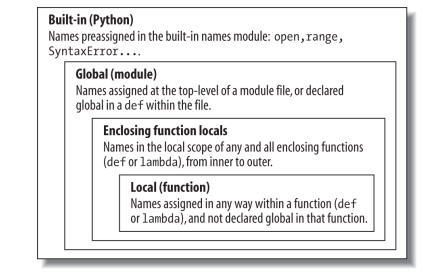

# 1. Phạm vi scope

Giống như các file module, phạm vi giúp ngăn chặn xung đột tên trên mã chương trình của bạn. Khi bạn sử dụng tên trong một chương trình, Python sẽ tạo ra thay đổi hoặc tra cứu tên trong thứ được gọi là không gian tên namespace, nơi chứa tên trực tiếp. Khi chúng ta nói về việc tìm kiếm giá trị của name liên quan đến mã, thuật ngữ phạm vi đề cập đến một không gian tên: nghĩa là vị trí của chỉ định tên trong nguồn của bạn mã xác định phạm vi hiển thị của tên đối với mã của bạn.


Python sử dụng vị trí của việc gán tên để liên kết nó với một không gian tên cụ thể. Nói cách khác, nơi bạn chỉ định tên trong mã nguồn của mình xác định không gian tên mà nó sẽ tồn tại và do đó phạm vi hiển thị của nó.

Các mã khi đóng gói để sử dụng lại, các hàm còn thêm một lớp không gian tên thêm vào chương trình của bạn để giảm thiểu khả năng xung đột giữa các biến cùng tên(bởi mặc định), tất cả các tên được chỉ định bên trong một hàm được liên kết với không gian tên của hàm đó.

Quy tắc này có nghĩa là:

+ **Các tên được gán bên trong một def chỉ có thể được nhìn thấy bởi mã trong def đó.**

+ **Các tên được gán bên trong một def không xung đột với các biến bên ngoài def.**

Trong mọi trường hợp, phạm vi của một biến (nơi nó có thể được sử dụng) luôn được xác định bởi nơi
nó được gán trong mã nguồn của bạn và không liên quan gì đến hàm nào gọi hàm nào.

Trên thực tế các biến có thể được chỉ định ở ba vị trí khác nhau, tương ứng với ba phạm vi khác nhau:

+ Nếu một biến được gán bên trong một def, thì nó là cục bộ **local** của hàm đó.

+ Nếu một biến được gán trong một def đi kèm, thì biến đó là phi địa phương **non local** đối với các hàm lồng nhau.

+ Nếu một biến được gán bên ngoài tất cả các định nghĩa, nó là toàn cầu **gobal** chung của chương trình.

Ví dụ: trong tệp mô-đun sau, phép gán X = 99 tạo ra một biến toàn cục có tên là X (hiển thị ở mọi nơi trong tệp này), nhưng phép gán X = 88 tạo ra một biến biến cục bộ X (chỉ hiển thị trong câu lệnh def)

```python
X = 99 # Global scope X
def func():
    X = 88
```

Mặc dù cả hai biến đều được đặt tên là X, nhưng phạm vi của chúng khiến chúng khác nhau giúp tránh xung đột tên trong chương trình của bạn và giúp làm cho các hàm số trở thành một chương trình khép kín hơn ,mã của chúng không cần quan tâm với tên được sử dụng ở những nơi khác.

+ **Enclosing module là phạm vi global.** Mỗi mô-đun là một phạm vi toàn cầu — điều đó là, một không gian tên trong đó các biến được tạo (gán) ở cấp cao nhất của module.

+ **Phạm vi toàn cầu chỉ trải dài trên một tệp duy nhất.** Đừng để bị lừa bởi từ “toàn cầu” ở đây các tên ở cấp cao nhất của tệp chỉ có giá trị chung cho mã trong tệp duy nhất đó. Khi nào bạn nghe thấy “toàn cầu” trong Python, hãy nghĩ đến “module”.

+ **Tên được gán là tên local trừ khi được khai báo global hoặc nonlocal.** Theo mặc định, tất cả các tên được gán bên trong định nghĩa hàm được đặt trong phạm vi cục bộ (vùng tên được liên kết với lệnh gọi hàm). Nếu bạn cần chỉ định một tên nằm ở cấp cao nhất của module bao quanh hàm, bạn có thể làm như vậy bằng cách khai báo nó trong một câu lệnh toàn cục bên trong hàm.

+ **Tất cả các tên khác đều bao quanh hàm số local, global hoặc built-in.** Tên không được chỉ định một giá trị trong định nghĩa hàm được giả định là bao gồm phạm vi địa phương, được định nghĩa trong một câu lệnh def xung quanh, global nằm trong bao quanh không gian tên của module; hoặc built-in do Python cung cấp.

+ **Mỗi lệnh gọi đến một hàm sẽ tạo ra một phạm vi cục bộ mới.** Mỗi khi bạn gọi một hàm, bạn tạo một phạm vi cục bộ mới, nghĩa là  một không gian tên trong đó các tên được tạo bên trong hàm số sẽ tồn tại.

# 2. Quy tắc LEGB

Trong một câu lệnh def:

+ Việc gán tên tạo hoặc thay đổi tên địa phương(name local) theo mặc định.

+ Tên tham chiếu khi tìm kiếm nằm gồm bốn phạm vi: local, enclose local, gobal, built-in.

+ Các tên được khai báo trong các câu lệnh global và nonlocal ánh xạ các tên được gán cho các phạm vi bultin-in và phạm vi hàm số.

Lược đồ mô tả tên của Python đôi khi được gọi là quy tắc LEGB, phạm vi tên:

+ Khi bạn sử dụng tên không đủ tiêu chuẩn bên trong một hàm, Python sẽ tìm kiếm tối đa bốn phạm vi phạm vi cục bộ (L), phạm vi enclosing khi nested def (E), sau đó là phạm vi toàn cục (G) và sau đó là phạm vi built-in (B) và dừng lại đầu tiên ở nơi cái tên được tìm thấy. Nếu không tìm thấy tên trong quá trình tìm kiếm này, Python báo lỗi.

+ Khi bạn gán tên trong một hàm (thay vì chỉ tham chiếu đến nó trong một biểu thức), Python luôn tạo hoặc thay đổi tên trong phạm vi local, trừ khi nó được khai báo là global hoặc non local trong hàm đó.

+ Khi bạn gán tên bên ngoài bất kỳ hàm số nào tức là ở cấp cao nhất của module, phạm vi cục bộ giống với phạm vi toàn cầu, không gian tên của module.



## Global scope

```python
X = 99  # X và func được chỉ định trong module là global
def func(Y): # Y and Z được chỉ định trong hàm số là locals
    # Local scope
    Z = X + Y # X là gobal
    return Z
func(1)
```

`Output: 100`

## Built-in scope

```python
import builtins
builtins.zip
```

`Ouput: zip`

## Cách chuyển từ local thành gobal

```python
X = 88  # X là Global 
def func():
    global X
    X = 99 
func()
print(X)
```

`Output: 99`

```python
y, z = 1, 2
def all_global():
    global x
    x = y + z
all_global()
x
```

`Output: 3`

Ta thấy khi hàm all_gobal() khai báo thì x chuyển thành global.

```python
X = 99
def func1():
    global X
    X = 88
def func2():
    global X
    X = 77
a=func1()
X
```

`Output: 88`

Nếu func1 không được gọi ở module thì giá trị X sẽ vẫn là 99.

## Nested Scope

```python
X = 99 # Global scope tên: không được sử dụng
def f1():
    X = 88 # Enclosing def local
    def f2():
        print(X) # Reference trong nested def
    f2()
    
f1()
```
`Ouput: 88`

```python
def maker(N):
    def action(X): # Make and return action
        return X ** N # action retains N from enclosing scope
    return action
f = maker(2)
f
```
`Output: <function __main__.maker.<locals>.action(X)>`
```python
f(3)
```
`Output: 9`
```python
g = maker(3) # g ghi nhớ 3
g(4)
```
`Output: 64`
## Không dùng lồng hàm
```python
def f1():
    x = 88 # Pass x thay vì lồng hàm nesting
    f2(x) # tham khảo tiếp theo 
def f2(x):
    print(x)
f1()
```
`Ouput: 88`
```python
def func():
    x = 4
    action = (lambda n: x ** n) # x nhớ from enclosing def
    return action
x = func()
print(x(2))
```
`Output: 16`
```python
def makeActions():
    acts = []
    for i in range(5): # 
        acts.append(lambda x: i ** x) # all remember giá trị i cuối cùng là 4
    return acts
acts = makeActions()
acts
```
Output:
```[<function __main__.makeActions.<locals>.<lambda>(x)>,
    <function __main__.makeActions.<locals>.<lambda>(x)>,
    <function __main__.makeActions.<locals>.<lambda>(x)>,
    <function __main__.makeActions.<locals>.<lambda>(x)>,
    <function __main__.makeActions.<locals>.<lambda>(x)>]
```

```python
acts[0](2)
```
`Output: 16`

Nó chỉ ghi nhớ giá trị cuối cùng của mảng.

Sửa lỗi như sau:

```python
def makeActions():
    acts = []
    for i in range(5):
        acts.append(lambda x, i=i: i ** x) # Remember giá trị i
    return acts
acts = makeActions()
acts[1](2)
```
`Output: 1`
## Nonlocal Scope

```python
def tester(start):
    state = start # Referencing nonlocals hoạt động bình thường
    def nested(label):
        print(label, state,sep=',') # Ghi nhớ state in enclosing scope
    return nested
F = tester(0)
F('spam')
```
`Output: spam,0`

Ta thêm biến trạng thái vào

```python
def tester(start):
    state = start  
    def nested(label):
        print(label, state)
        state += 1 # Thêm một câu lệnh
    return nested
F = tester(0)
F('spam')
```
`Output: UnboundLocalError: local variable 'state' referenced before assignment`

Sửa lỗi như sau:

```python
def tester(start):
    state = start # Mỗi lần gọi nó sẽ lấy một state 
    def nested(label):
        nonlocal state # Ghi nhớ state in enclosing scope
        print(label, state)
        state += 1 # Cho phép thay đổi nếu nó là nonlocal
    return nested
F = tester(0)
F('spam')
```
`Output: spam 0`
```python
F('ham')
```
`Output: ham 1`
## Non local có ranh giới
```python
def tester(start):
    def nested(label):
        nonlocal state # Nonlocals bắt buộc already tồn tại trong enclosing def!
        state = 0
        print(label, state)
    return nested
```
`Output: SyntaxError: no binding for nonlocal 'state' found`

Sửa lỗi như sau:

```python
def tester(start):
    def nested(label):
        global state # Globals không có tồn tại khi khai báo 
        state = 0 # Tạo mới state
        print(label, state)
    return nested
F = tester(0)
F('abc')
```
`Output: abc 0`
```python
spam = 99
def tester():
    def nested():
        nonlocal spam # Bắt buộc nó phải trong một def, ngoài def không được
        print('Current=', spam)
        spam += 1
    return nested
```
`Output: SyntaxError: no binding for nonlocal 'spam' found`

Sửa lỗi như sau:

```python
def tester(start):
    state = start # Mỗi lần gọi lấy state của nó 
    def nested(label):
        nonlocal state # Ghi nhớ state trong enclosing scope
        print(label, state)
        state += 1 # Cho phép thay đổi nó if nonlocal
    return nested
F = tester(0)
F('spam')
```
`Output: spam 0`
```python
F.state
```
`Output: AttributeError: 'function' object has no attribute 'state'`

Sửa lỗi tiếp như sau:

```python
def tester(start):
    global state # Di chuyển từ ngoài tới module trong nó 
    state = start # global cho phép thay đổi trong module scope
    def nested(label):
        global state
        print(label, state)
        state += 1
    return nested
F = tester(0)
F('spam')
```
`Output: spam 0`

