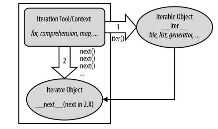

# 5.1 Nhắc lại vòng lặp
Chúng ta đã gặp hai câu lệnh lặp của Python là while và for và chúng có thể xử lý hầu hết các tác vụ lặp đi lặp lại mà chương trình cần thực hiện, nhu cầu lặp lại qua chuỗi quá phổ biến và phổ biến đến mức Python cung cấp các công cụ bổ sung để làm cho nó đơn giản và hiệu quả hơn.

Cụ thể các khái niệm liên quan về giao thức lặp của Python, một mô hình gọi phương thức được sử dụng bởi vòng lặp for và điền vào một số element của list comprehension, là anh em họ hàng gần với vòng lặp for áp dụng một biểu thức cho các index trong một vòng lặp có thể lặp lại. 
## Kiểu tuần tự list
```python
for x in [1, 2, 3, 4]: print(x ** 2, end=' ')
```
`Output: 1 4 9 16`
## Kiểu tuần tự tuple
```python
for x in (1, 2, 3, 4): print(x ** 3, end=' ')
```
`Output: 1 8 27 64`
## Kiểu tuần tự string
```python
for x in 'spam': print(x * 2, end=' ')
```
`Output: ss pp aa mm`

Khái niệm về iterable như sau một đối tượng được coi là có thể lặp lại nếu nó là một trình tự được lưu trữ vật lý hoặc một đối tượng tạo ra một kết quả tại một thời điểm trong ngữ cảnh của một công cụ lặp lại như vòng lặp for. Theo một nghĩa nào đó, các đối tượng có thể lặp lại bao gồm cả chuỗi vật lý và chuỗi ảo được tính toán theo yêu cầu.

Bất kỳ đối tượng nào với một phương thức \_\_next\_\_ để chuyển đến kết quả tiếp theo tăng lên và kết thúc iterable thì StopIteration sẽ hiện thị và báo lỗi, được coi là một trình lặp trong Python. 

Bất kỳ đối tượng nào cũng có thể được thực hiện bằng vòng lặp for hoặc công cụ lặp khác, vì tất cả các công cụ lặp thường hoạt động nội bộ bằng cách gọi \_\_next\_\_ trên mỗi lần lặp và bắt ngoại lệ StopIteration để xác định thời điểm thoát. 

Hình bên dưới cho thấy giao thức lặp lại đầy đủ này, được sử dụng bởi mọi công cụ lặp lại bằng Python và được hỗ trợ bởi nhiều loại đối tượng. Nó thực sự dựa trên hai đối tượng được sử dụng theo hai bước riêng biệt bằng các công cụ lặp:

+ Đối tượng có thể lặp lại mà bạn yêu cầu lặp lại phải có \_\_iter\_\_ được chạy bởi iter

+ Đối tượng vòng lặp được trả về bởi có thể lặp lại tạo ra các giá trị trong sự lặp lại, có \_\_next\_\_ được chạy bởi next và tăng lên, StopIteration khi kết thúc quá trình lặp

Các bước này được sắp xếp tự động bởi các công cụ lặp lại trong hầu hết các trường hợp, nhưng nó sẽ giúp để hiểu vai trò của hai đối tượng này. Ví dụ, trong một số trường hợp, hai đối tượng này
giống nhau khi chỉ hỗ trợ một lần quét (ví dụ: tệp) và đối tượng trình lặp là thường tạm thời, được sử dụng nội bộ bởi công cụ lặp.

Hơn nữa, một số đối tượng vừa là một công cụ ngữ cảnh lặp lại (chúng lặp lại) vừa là một
đối tượng (kết quả của chúng có thể lặp lại) bao gồm các biểu thức như map và zip trong Python 3.X. Như chúng ta sẽ thấy có nhiều công cụ hơn trở nên có thể lặp lại trong 3.X, bao gồm map, zip, range và một số phương thức của từ điển, để tránh tạo kết quả danh sách trong bộ nhớ cùng một lúc.



Xem ví dụ sau đây:
```python
L = [1, 2, 3]
I = iter(L) # Lấy một đối tượng trình lặp(iterator) từ iterable
I.__next__() # Gọi iterator để next chuyển sang item tiếp theo
```
`Ouput: 1`
Lần lặp tiếp theo.
```python
I.__next__()
```
`Output: 2`
Lần lặp tiếp theo.
```python
I.__next__()
```
`Output: 3`
Lần lặp tiếp theo.
```python
I.__next__()
```
`Output: StopIteration:`
Báo ngoại lệ  StopIteration vì đã chạy hết danh sách.

Danh sách và nhiều đối tượng trong built-in khác có thể không phải là trình vòng lặp(iterator) của riêng chúng vì chúng hỗ trợ nhiều lần lặp lại mở (iteration), ví dụ: có thể có nhiều lần lặp lại trong các vòng lặp lồng nhau ở các vị trí khác nhau. Đối với các đối tượng như vậy, chúng ta phải gọi iter để bắt đầu lặp lại.
```python
L = [1, 2, 3]
iter(L) is L
```
`Output: False`
Ta thấy nó khác object ngay.
```python
L.__next__()
```
`Output: AttributeError: 'list' object has no attribute '__next__'`
Và L chỉ là iterable nên không thể tự lặp được.
```python
L = [1, 2, 3]
I = iter(L) 
I.__next__() 
```
`Output: 1`


