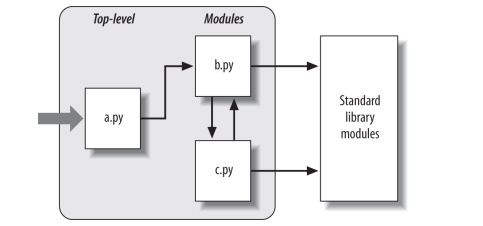

# 6.1 Tại sao phải sử dụng module?
Các module cung cấp cho chúng ta có thể dễ dàng tổ chức các thành phần 
trong một hệ thống bằng cách dưới dạng các gói packages chứa các biến được gọi là không gian tên namespaces. 
Module có hai vai trò phổ biến:

+ **Sử dụng lại mã**

  Các module cho phép bạn lưu mã trong tệp vĩnh viễn, mã trong các tệp mô-đun là liên tục và nó có thể được tải lại và 
  chạy lại bao nhiêu khi cần thiết.
+ **Phân vùng không gian tên hệ thống**

  Module cũng là đơn vị tổ chức chương trình cấp cao nhất trong Python. 
  Mặc dù về cơ bản chúng chỉ là các gói tên các gói này cũng độc lập, bạn không bao giờ có thể thấy tên trong một tệp khác, 
  trừ khi bạn nhập rõ ràng tên đó tập tin. 
  Giống như các phạm vi cục bộ trong hàm số giúp ta tránh xung đột tên giữa các chương trình của bạn. 
  
## Cấu trúc của một chương trình Python
Ở cấp cơ sở, một chương trình Python bao gồm các tệp văn bản chứa các câu lệnh Python,
với một tệp chính top-level hoặc nhiều tệp bổ sung được gọi là module.

+ Tệp top-level chứa luồng điều khiển chính của chương trình của bạn, đây là tệp bạn chạy để khởi chạy ứng dụng của mình. 

+ Các tệp module là thư viện các công cụ được sử dụng để thu thập các thành phần được sử dụng bởi tệp top-level và có thể
ở nơi khác. 

Hình bên dưới mô tả cấu trúc của chương trình Python bao gồm ba tệp: a.py, b.py và c.py. 
Tệp a.py được chọn làm tập top-level, nó sẽ là một tệp văn bản đơn giản của các câu lệnh, 
được thực thi từ trên xuống dưới cùng khi khởi chạy. 
Các tệp b.py và c.py là các module chúng cũng là những tập tin văn bản đơn giản
cũng như các câu lệnh, nhưng chúng thường không được đưa ra trực tiếp.



Ví dụ: Tệp b.py có hàm số là spam
```python
def spam(text): # File b.py
    print(text,'spam')
```
Nội dụng tệp top-level
```python
import b
b.spam('gumby')
```
`Output: gumby spam`

Module thư viện tiêu chuẩn là một số module mà chương trình của bạn
sẽ khi tạo được cung cấp bởi chính Python và không phải là các tệp bạn sẽ viết mã.
Bộ sưu tập này có hơn 200 module lớn chứa hỗ trợ độc lập với nền tảng cho các tác vụ lập trình thông thường.
## Các import hoạt động
Chúng là các hoạt động thời gian chạy khi một chương trình nhập một tệp lần đầu tiên được chạy sẽ thực hiện 3 bước:

1. Tìm tệp của module.
2. Biên dịch nó thành mã byte (nếu cần).
3. Chạy mã của module để xây dựng các đối tượng mà nó xác định.
### Không gian tên mô-đun
Module có lẽ được hiểu đơn giản là các gói tên. Về mặt kỹ thuật, các module
thường tương ứng với các tệp và Python tạo một đối tượng module để chứa tất cả các tên
được chỉ định trong một tệp module. Nhưng thật chất, module chỉ là không gian tên (địa điểm
nơi các tên được tạo) và các tên tồn tại trong một module được gọi là các thuộc tính của nó.

Không gian tên module có thể được truy cập thông qua thuộc tính__dict__ hoặc dir(M).

```python
print('starting to load...') # File module1.py
name = 42
def func(): pass
class klass: pass

print('done loading.')
```
Kiểm tra thuộc tính của module thông qua \_\_dict\_\_
```python
import module1
list(module1.__dict__.keys())
```
`Output: ['__name__', '__doc__', '__package__', '__loader__', '__spec__', '__file__', '__cached__', '__builtins__', 'name', 'func', 'klass']`
## Reloading Module
Các của module chỉ được chạy một lần cho chạy chương trình. Để có thể gọi lại module để chạy lại ta có thể gọi hàm **reload**
trong built-in function.
```python
X=5 # File changer.py
```
Ta thực hiện reload sau đây
```python
import changer

changer.X = 10
print(chager.X)

import changer
print(changer.X)

from importlib import reload

reload(changer)
print(changer.X)
```
Ouput:
```
10
10
5
```

